# Agentic Project Management (APM)

 

_Manage complex projects with a team of AI assistants, smoothly and efficiently._

## What is APM?

**Agentic Project Management (APM)** is a framework that brings real-world project management principles into your AI-assisted workflows. If you're using AI coding assistants (like in Cursor, ChatGPT, or Claude) for development, research, or any complex task, APM provides a structured yet flexible way to coordinate a team of specialized AI agents.

Think of it like having a project manager, developers, and specialists, all powered by AI, working in concert under your guidance.

```mermaid
graph LR
    User["👤 User (You!)"]
    MA["🤖 Manager Agent"]
    SA_I["🛠️ Implementation Agent(s)"]
    SA["🕵️‍♂️ Specialized Agents <br/> (e.g., Debugger, Tutor)"]
    MB["📚 Memory Bank(s)"]

    User <--> MA
    MA --> SA_I
    MA --> SA

    MA <--> MB
    SA_I <--> MB
    SA <--> MB

    classDef user fill:#E3F2FD,stroke:#1E88E5,stroke-width:2px,color:#0D47A1;
    classDef manager fill:#EDE7F6,stroke:#5E35B1,stroke-width:2px,color:#311B92;
    classDef specializedAgent fill:#FCE4EC,stroke:#AD1457,stroke-width:2px,color:#880E4F;
    classDef memoryBank fill:#E8F5E9,stroke:#388E3C,stroke-width:2px,color:#1B5E20;

    class User user;
    class MA manager;
    class SA_I,SA specializedAgent;
    class MB memoryBank;
```

## Why APM?

Working with AI on big projects can get messy. Context gets lost, agents forget instructions, and it can feel like you're repeating yourself endlessly, often leading to high token usage and costs. APM tackles this by:

- **Mimicking Real Teams:** It uses clear roles (Manager, Implementer) and proven processes, making AI collaboration more intuitive.
- **Smart Agent Management:** APM incorporates techniques like a **Memory Bank** (a shared project logbook), detailed **Markdown Prompts** for consistent agent behavior, and the concept of **Specialized Agents** for focused tasks. This provides a sophisticated workflow with robust error handling.
- **Efficient & Budget-friendly :** APM aims for a balance. It's designed to be streamlined and cost-effective, helping you get great results without "burning" through your tokens or API requests.
- **User-Centric Control:** This system puts you in the driver's seat. It emphasizes user guidance and oversight at critical points. If an agent struggles or context limits are hit, APM provides clear solutions like **Handover Protocols** (to smoothly switch to "fresh" agents) and relies on the **Memory Bank System** to keep the entire workflow aligned.

## Getting Started:

Here's how to get the core APM framework up and running for your project:

**Accessing APM Assets:** You have a few options to get the APM prompts, guides and protocol definitions:

1.  **Use the APM Template (Recommended for Custom Projects):**
    - Click the "Use this template" button on the [APM GitHub Repository](https://github.com/sdi2200262/agentic-project-management).
    - This creates _your own repository_ pre-filled with the entire APM structure.
    - **Ideal Setup:** Clone _your new repository_ to the root of your project workspace. This ensures the Manager Agent can easily reference all APM guides if you confirm full asset availability.
2.  **Clone the Official APM Repository (Recommended for Direct Use & Updates):**
    - Clone the main [APM GitHub Repository](https://github.com/sdi2200262/agentic-project-management) directly into your project workspace, ideally at the root.
    - This gives you direct access to the latest version and all assets.
3.  **Manual Copy-Pasting (Basic Usage):**
    - You can copy-paste the content of prompts (like `01_Initiation_Prompt.md`) directly from the official APM GitHub repository into your AI assistant as needed.
    - While this works, it requires more manual effort from you to provide guide contents when the Manager Agent requests them.

**Regardless of your choice, the key is for the APM assets (especially the `prompts/` directory) to be consistently accessible, ideally from the root of your project workspace if you intend for the Manager Agent to operate with full file awareness.**

**Initiating APM within your Project:**

1.  **Initial Prompt for Your Manager:** Navigate to `prompts/00_Initial_Manager_Setup/01_Initiation_Prompt.md` (either in your cloned APM repo, your template-based repo, or from the GitHub website).
2.  **Copy & Paste:** Copy its _entire content_.
3.  **Launch Your Manager Agent:** Paste this content as the very first message to your primary AI assistant (e.g., in a new Cursor chat tab). This AI will now become your first APM Manager Agent!
4.  **Follow the Lead:** Your new Manager Agent, guided by this prompt, will then ask you questions to understand your project and start setting up your Implementation Plan and a Memory Bank System.

**Optional: Boosting APM with Cursor Rules (Recommended for Cursor Users)**

- If you are using the **Cursor IDE**, APM provides a set of pre-defined [Cursor Rules](https://docs.cursor.com/context/rules) in the `rules/` directory (or `.cursor/rules/` in your project's workspace) designed to enhance agent reliability and workflow efficiency with minimal impact on context window usage.
- These rules target specific points in the APM workflow, providing context reinforcement to the Manager and the Implementation Agents.
- See the `rules/README.md` and the [Cursor Integration Guide](docs/04_Cursor_Integration_Guide.md) for easy setup instructions.
- **Concept for Other IDEs:** The principle of using IDE-specific, persistent, scoped instructions could potentially be adapted for other AI-integrated IDEs that offer similar rule-like or custom instruction features like Windsurf, Roo etc. If you explore this for another platform and find a viable approach, please consider sharing your insights by opening an issue or a Pull Request on the APM GitHub repository!

## Dive Deeper

This README gives you the essentials. For a more in-depth understanding of the APM workflow, advanced features, customization, and the technical details behind each component:

- 🚀 **[Full APM Documentation](docs/)** - Your comprehensive guide.
- ⚙️ **[Example Cursor Rules](rules/)** - Optional rules to enhance APM if you're using the Cursor IDE. Check out the `rules/README.md` for how they work.
- 🖱️ **[Cursor Integration Guide](docs/04_Cursor_Integration_Guide.md)** - Tips for using APM optimally within Cursor, including setting up project-specific rules.

_(Alternatively, you can always browse prompts and docs directly from [here.](https://github.com/sdi2200262/agentic-project-management))_

## Contributing

APM is an open-source project, and your ideas are welcome! Whether it's improving prompts, enhancing documentation, suggesting new features, or reporting bugs, flaws in the flow or anything faulty please feel free to open an issue or submit a pull request.

Please read [CONTRIBUTING.md](CONTRIBUTING.md) for details on the code of conduct and how to contribute.

## License

This project is licensed under the MIT License - see the [LICENSE](LICENSE) file for details.

  

## Key Improvements in Version 0.3.0

Version 0.3.0 focuses on enhancing robustness, agent output consistency, the clarity of planning, and the reliability of context transfer during handovers. Key changes include:

- **Enhanced Memory System:**
    - Stricter validation of Memory Bank structures (directories, log files) against the `Implementation_Plan.md` to ensure consistency and prevent mismanagement (see `prompts/01_Manager_Agent_Core_Guides/02_Memory_Bank_Guide.md`).
    - Improved log quality guidelines in `prompts/02_Utility_Prompts_And_Format_Definitions/Memory_Bank_Log_Format.md` emphasizing concise, informative entries with clear examples.
- **More Detailed and Consistent Implementation Planning & Task Assignment:**
    - The `prompts/01_Manager_Agent_Core_Guides/01_Implementation_Plan_Guide.md` now mandates:
        - Stronger emphasis on explicit agent assignment for every task to ensure balanced workload distribution and clarity.
        - Inclusion of brief "Guiding Notes" (e.g., key methods, libraries, parameters) within each task's action steps. This provides crucial direction directly in the plan to ensure methodological consistency across tasks and agents.
    - The `prompts/01_Manager_Agent_Core_Guides/03_Task_Assignment_Prompts_Guide.md` has been updated to ensure Manager Agents explicitly use and expand upon these "Guiding Notes" from the `Implementation_Plan.md` when creating detailed, actionable prompts for Implementation Agents.
- **More Robust Handover Protocol:**
    - The handover process now includes a step for the outgoing agent to explicitly capture and transfer the most recent conversational context and unlogged user directives, ensuring the incoming agent has the freshest layer of user intent (see `prompts/01_Manager_Agent_Core_Guides/05_Handover_Protocol_Guide.md`).
    - The `prompts/02_Utility_Prompts_And_Format_Definitions/Handover_Artifact_Format.md` has been restructured for enhanced clarity and usability in documenting handover context.
