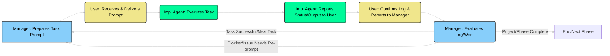
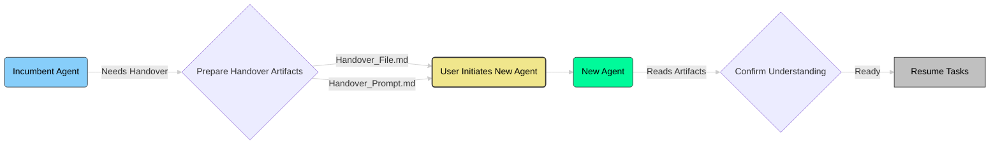
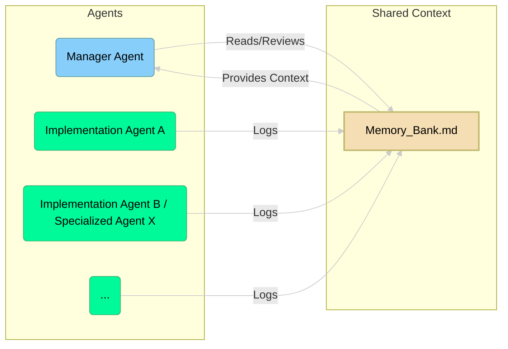

# APM Workflow Overview

This document provides a visual overview of the key processes and interactions within the Agentic Project Management (APM) framework using Mermaid diagrams. It complements the detailed textual explanations found in other documentation files.

## Core APM Cycle

This flowchart illustrates the main life cycle of task management within an APM project, highlighting the collaboration between the User, Manager Agent, and Implementation Agents.

**Explanation:**

1.  The **Manager Agent** prepares the `Task Assignment Prompt` (often with User input/review).
2.  The **User** receives this prompt and delivers it to the designated **Implementation Agent**.
3.  The **Implementation Agent** executes the assigned task.
4.  The **Implementation Agent** reports its status, any outputs, or blockers back to the **User**.
5.  The **User** confirms if/how to log the work and relays this information along with the agent's report to the **Manager Agent**.
6.  The **Manager Agent** evaluates the logged work and the reported status.
7.  Based on the evaluation, the cycle either loops back for the **Manager** to prepare the next task, addresses issues, or concludes the current phase/project.

## Handover Protocol Flow

This flowchart shows the high-level process for transferring context when an agent needs to be replaced (e.g., due to context limits).

**Explanation:**

1.  The **Incumbent Agent** (or User/Manager) identifies the need for a handover.
2.  The necessary handover artifacts (`Handover_File.md` for context, `Handover_Prompt.md` for initialization) are prepared (usually by the Manager or outgoing agent with help).
3.  The **User** starts the **New Agent** instance using the prepared artifacts.
4.  The **New Agent** processes the handover context.
5.  The **New Agent** confirms its understanding to the **User**.
6.  Once confirmed, the **New Agent** takes over and resumes the project tasks.

## Memory Bank Concept

This diagram shows how multiple agents contribute to and read from the central Memory Bank(s), inspired by the visual layout.

**Explanation:**

- All task-executing agents (**Implementation Agent A**, **Implementation Agent B / Specialized Agent X**, etc.) write their structured logs to the central **Memory Bank(s)**.
- The **Manager Agent** reads from the **Memory Bank** to review work, track progress, and maintain overall project context.
- The **Memory Bank** effectively provides context back to the **Manager Agent** for its coordination and planning functions.

These diagrams provide a simplified visual guide to understanding the flow and interactions within the APM framework. For detailed explanations of each component and procedure, please refer to the other documents in this `/docs` directory and the prompt guides in the `/prompts` directory.
